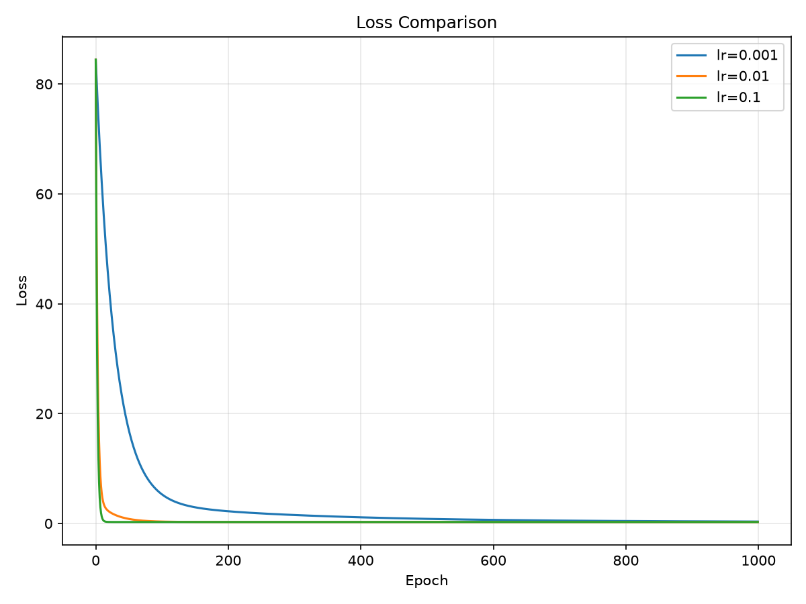

# Week 1 - NumPy Linear Regression

## 本周目标

- 学习 NumPy 基础
- 理解训练集、验证集、测试集
- 理解 MSE 与梯度下降
- 从零实现一元线性回归
- 比较不同 learning rate
- 完成实验结果可视化

## 实验结果

- Best learning rate: 0.01
- Best w: 3.0190
- Best b: 2.0195
- Test MSE: 0.2670
- Mean baseline MSE: 79.7631

## Loss Curve

